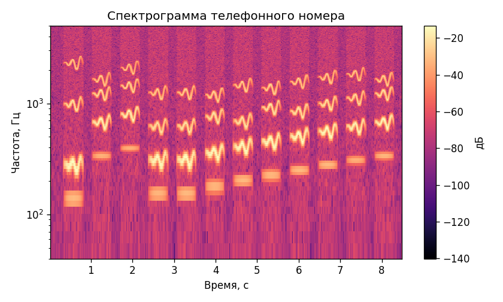
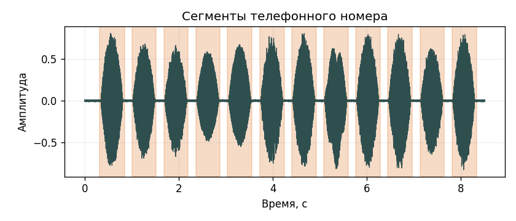

# Лабораторная работа №10
## Вариант 3. Анализатор речи

В репозитории не было записей с микрофона, поэтому для воспроизводимой реализации сгенерированы одноканальные WAV-образцы слов `ноль` ... `девять` и `плюс`, а также дорожка телефонного номера.

Распознаваемая дорожка: [lab10/audio/phone_number.wav](lab10/audio/phone_number.wav)

| Спектрограмма | Сегментация по энергии |
|:-------------:|:----------------------:|
|  |  |

### Алфавит

| Символ | Слово | Файл |
|:------:|:-----|:-----|
| `0` | ноль | [lab10/audio/alphabet/zero.wav](lab10/audio/alphabet/zero.wav) |
| `1` | один | [lab10/audio/alphabet/one.wav](lab10/audio/alphabet/one.wav) |
| `2` | два | [lab10/audio/alphabet/two.wav](lab10/audio/alphabet/two.wav) |
| `3` | три | [lab10/audio/alphabet/three.wav](lab10/audio/alphabet/three.wav) |
| `4` | четыре | [lab10/audio/alphabet/four.wav](lab10/audio/alphabet/four.wav) |
| `5` | пять | [lab10/audio/alphabet/five.wav](lab10/audio/alphabet/five.wav) |
| `6` | шесть | [lab10/audio/alphabet/six.wav](lab10/audio/alphabet/six.wav) |
| `7` | семь | [lab10/audio/alphabet/seven.wav](lab10/audio/alphabet/seven.wav) |
| `8` | восемь | [lab10/audio/alphabet/eight.wav](lab10/audio/alphabet/eight.wav) |
| `9` | девять | [lab10/audio/alphabet/nine.wav](lab10/audio/alphabet/nine.wav) |
| `+` | плюс | [lab10/audio/alphabet/plus.wav](lab10/audio/alphabet/plus.wav) |

### Распознавание

Ожидалось: `+79001234567`
Распознано: `+79001234567`
Найдено сегментов: `12`.
Ошибок: `0`, точность: `100.00%`, оценка достоверности: `39.89%`.

Гипотезы сохранены в [lab10/results/hypotheses.txt](lab10/results/hypotheses.txt); таблица сегментов — в [lab10/results/recognition.csv](lab10/results/recognition.csv).

| № | t0, c | t1, c | Лучший символ | Оценка | Отрыв |
|:--:|-----:|-----:|:-------------:|-------:|------:|
| 1 | 0.320 | 0.850 | `+` | 0.9285 | 0.4193 |
| 2 | 1.010 | 1.520 | `7` | 0.9373 | 0.3784 |
| 3 | 1.690 | 2.200 | `9` | 0.9353 | 0.3590 |
| 4 | 2.370 | 2.880 | `0` | 0.9381 | 0.4256 |
| 5 | 3.040 | 3.560 | `0` | 0.9330 | 0.4228 |
| 6 | 3.720 | 4.250 | `1` | 0.9256 | 0.4248 |
| 7 | 4.400 | 4.930 | `2` | 0.9269 | 0.4208 |
| 8 | 5.080 | 5.610 | `3` | 0.9267 | 0.3968 |
| 9 | 5.760 | 6.290 | `4` | 0.9257 | 0.3985 |
| 10 | 6.440 | 6.970 | `5` | 0.9265 | 0.3773 |
| 11 | 7.130 | 7.640 | `6` | 0.9368 | 0.3875 |
| 12 | 7.810 | 8.330 | `7` | 0.9332 | 0.3763 |

### Вывод

Реализованы построение спектрограммы, энергетическая сегментация дорожки, сопоставление сегментов с образцами алфавита и подсчёт ошибок распознавания.
