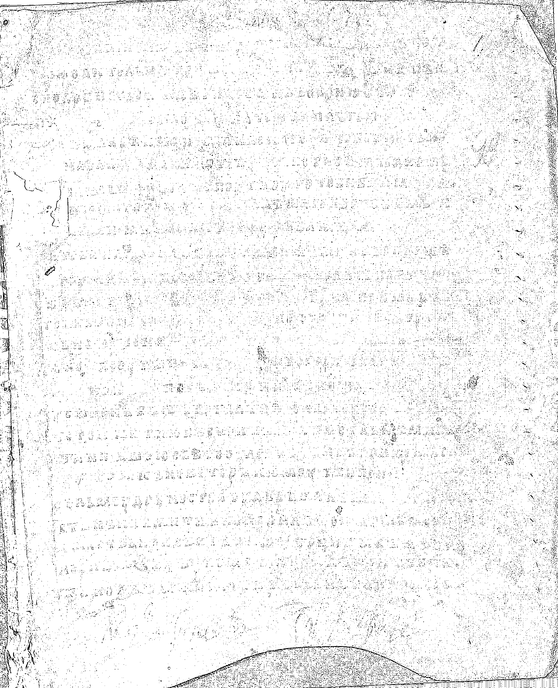
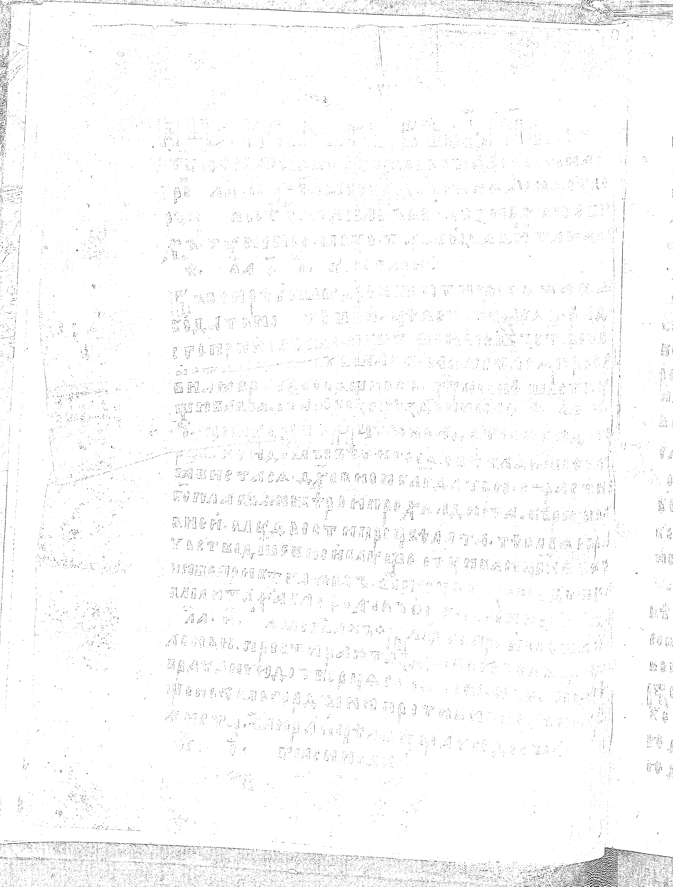
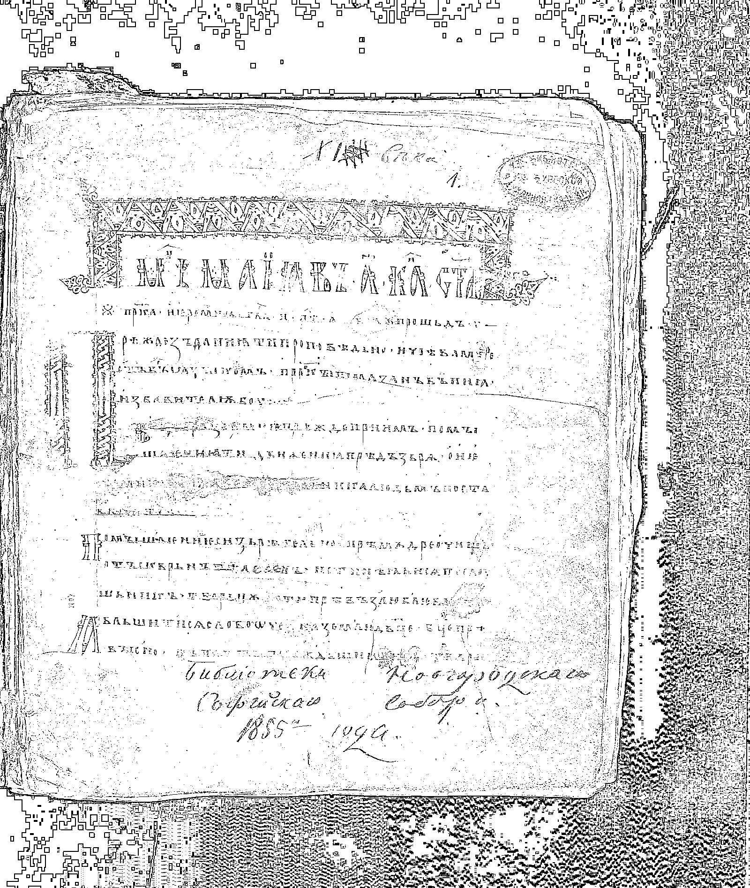
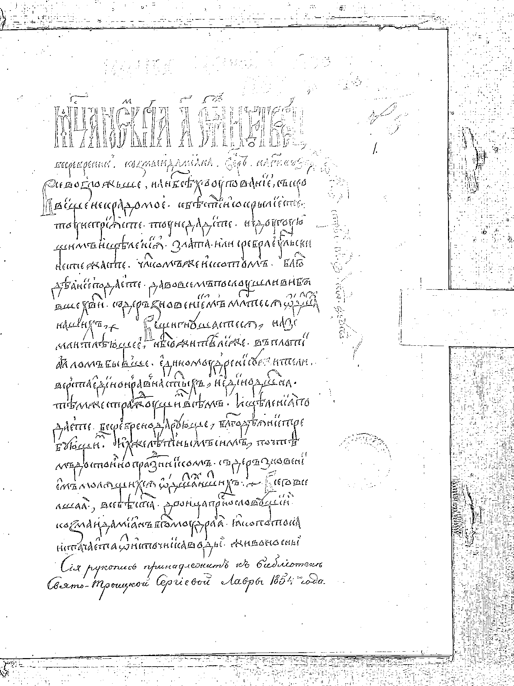

# Лабораторная работа №2
## Вариант 16. Обесцвечивание и бинаризация растровых изображений

Для изображений выполнены:
- перевод полноцветного изображения в полутоновое по взвешенному среднему каналов;
- адаптивная бинаризация методом Bradley-Roth.

Параметры бинаризации:
- окно: `5x5`;
- порог: `t = 15%`.

### Изображение 0

| Исходное | Полутоновое | Бинарное |
|:--------:|:-----------:|:--------:|
|  |  |  |

### Изображение 1

| Исходное | Полутоновое | Бинарное |
|:--------:|:-----------:|:--------:|
|  |  |  |

### Изображение 2

| Исходное | Полутоновое | Бинарное |
|:--------:|:-----------:|:--------:|
|  |  |  |

### Изображение 3

| Исходное | Полутоновое | Бинарное |
|:--------:|:-----------:|:--------:|
|  |  |  |

### Вывод

Получены полутоновые изображения и результат адаптивной пороговой обработки Bradley-Roth для варианта 16.
