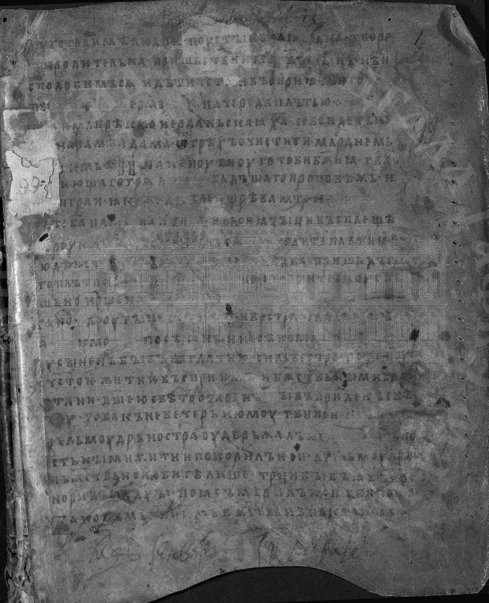
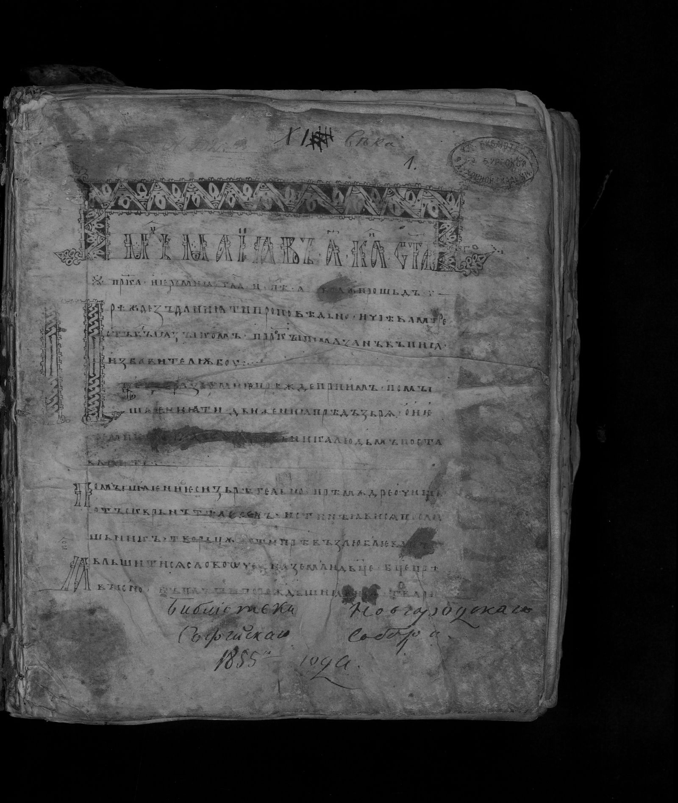
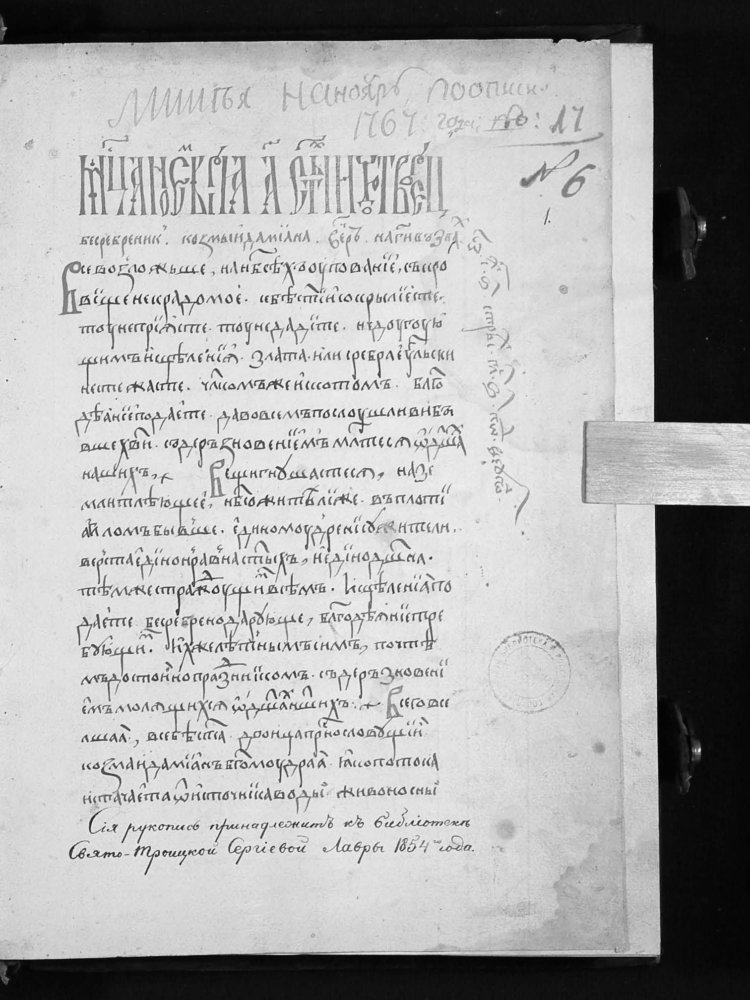

# Лабораторная работа №3
## Вариант 2. Фильтрация изображений и морфологические операции

Реализовано консервативное сглаживание с окном `3x3`.

Подготовка входных данных:
- исходное цветное изображение приведено к полутоновому виду;
- фильтр применяется к полутоновому изображению;
- разностное изображение построено как модуль разности и дополнительно нормализовано для лучшей видимости изменений.

### Изображение 0

| Исходное | Полутоновое | После фильтрации |
|:--------:|:-----------:|:----------------:|
|  |  |  |

| Модуль разности |
|:---------------:|
|  |

### Изображение 1

| Исходное | Полутоновое | После фильтрации |
|:--------:|:-----------:|:----------------:|
|  |  |  |

| Модуль разности |
|:---------------:|
|  |

### Изображение 2

| Исходное | Полутоновое | После фильтрации |
|:--------:|:-----------:|:----------------:|
|  |  |  |

| Модуль разности |
|:---------------:|
|  |

### Изображение 3

| Исходное | Полутоновое | После фильтрации |
|:--------:|:-----------:|:----------------:|
|  |  |  |

| Модуль разности |
|:---------------:|
|  |

### Вывод

Для варианта 2 выполнено консервативное сглаживание полутоновых изображений. Получены отфильтрованные изображения и карты изменений после обработки.
