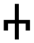
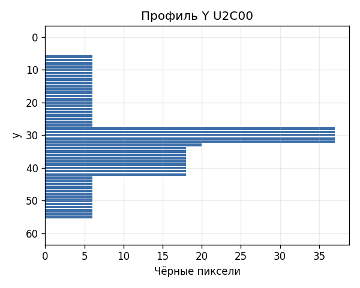
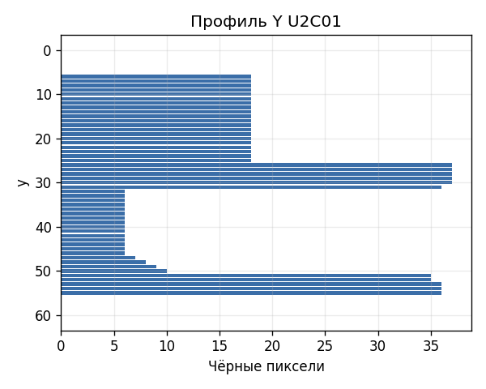
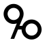
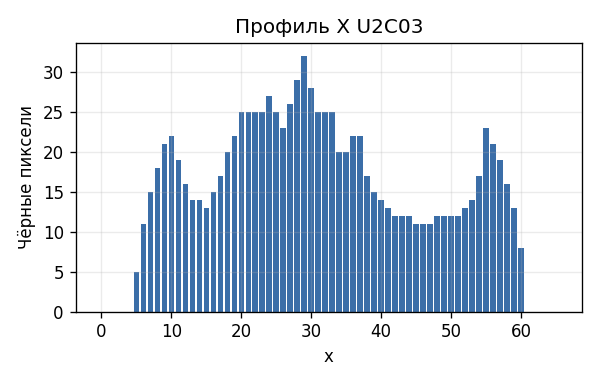

# Лабораторная работа №5
## Вариант 3. Выделение признаков символов

Выбранный алфавит: глаголица. Для эталонов использован один шрифт, один размер и один регистр букв.

Рассчитанные признаки:
- масса чёрного и удельная масса символа;
- масса и удельная масса каждой четверти изображения;
- координаты центра тяжести и нормированные координаты;
- осевые моменты инерции по горизонтали и вертикали и их нормированные значения;
- профили `X` и `Y` в виде столбчатых диаграмм.

Шрифт: `seguihis.ttf`, размер: `72`. Скалярные признаки сохранены в [lab5/results/features.csv](lab5/results/features.csv).

### Символ Ⰰ (U2C00)

| Эталон | Профиль X | Профиль Y |
|:------:|:---------:|:---------:|
|  |  |  |

### Символ Ⰱ (U2C01)

| Эталон | Профиль X | Профиль Y |
|:------:|:---------:|:---------:|
|  |  |  |

### Символ Ⰲ (U2C02)

| Эталон | Профиль X | Профиль Y |
|:------:|:---------:|:---------:|
|  |  |  |

### Символ Ⰳ (U2C03)

| Эталон | Профиль X | Профиль Y |
|:------:|:---------:|:---------:|
|  |  |  |

### Вывод

Сгенерированы эталонные изображения глаголических символов и рассчитан набор скалярных признаков, пригодный для последующей сегментации и классификации.
