# Лабораторная работа №6
## Вариант 3. Сегментация текста

Работа выполнена для выбранного в лабораторной №5 алфавита: глаголица.

Исходная строка: `ⰎⰣⰁⰎⰣ ⰕⰅⰁⰡ`. Монохромная версия сохранена в [lab6/images/phrase.bmp](lab6/images/phrase.bmp).

| Строка | Вертикальный профиль | Горизонтальный профиль |
|:------:|:--------------------:|:----------------------:|
|  | 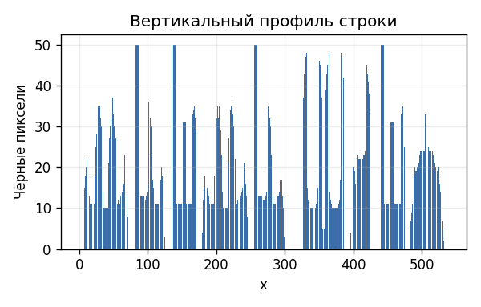 | 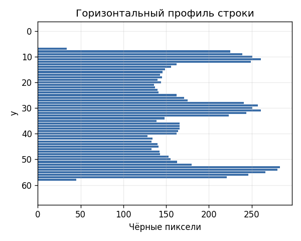 |

### Сегментация

Символы выделены по вертикальному профилю строки с объединением коротких внутренних разрывов. Ниже показаны найденные прямоугольники.

Найдено сегментов: `9`. Ожидалось символов без пробелов: `9`.

| № | Ожидаемый символ | Вырезанный сегмент |
|:--:|:----------------:|:------------------:|
| 1 | `Ⰾ` |  |
| 2 | `Ⱓ` |  |
| 3 | `Ⰱ` | 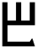 |
| 4 | `Ⰾ` |  |
| 5 | `Ⱓ` | 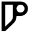 |
| 6 | `Ⱅ` |  |
| 7 | `Ⰵ` | 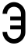 |
| 8 | `Ⰱ` |  |
| 9 | `Ⱑ` | 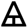 |

### Профили символов алфавита

#### Ⰰ (U2C00)

| Эталон | Профиль X | Профиль Y |
|:------:|:---------:|:---------:|
|  | 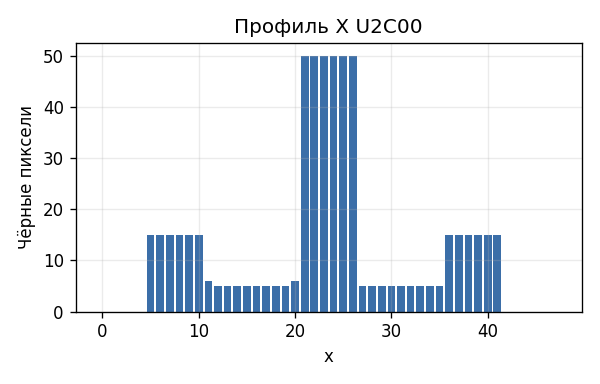 |  |

#### Ⰱ (U2C01)

| Эталон | Профиль X | Профиль Y |
|:------:|:---------:|:---------:|
| 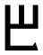 | 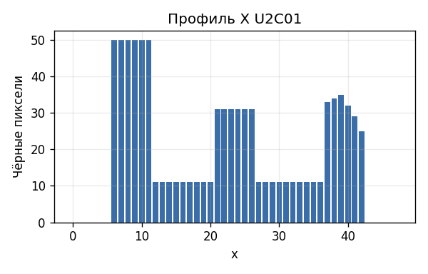 |  |

#### Ⰲ (U2C02)

| Эталон | Профиль X | Профиль Y |
|:------:|:---------:|:---------:|
| 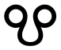 | 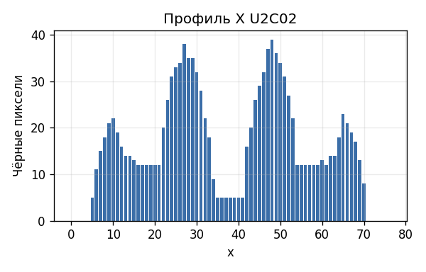 | 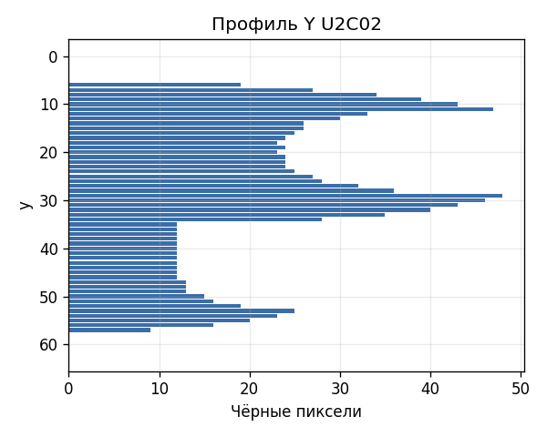 |

#### Ⰳ (U2C03)

| Эталон | Профиль X | Профиль Y |
|:------:|:---------:|:---------:|
|  |  | 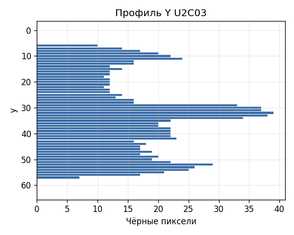 |

### Вывод

Построены горизонтальный и вертикальный профили строки, по профилю выделены символы и сохранены их обрамляющие прямоугольники и вырезанные изображения.
