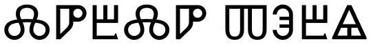
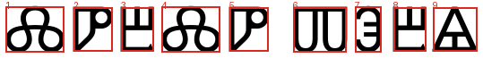
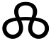
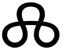

# Лабораторная работа №7
## Вариант 3. Классификация на основе признаков

Классификация выполнена для глаголического алфавита из лабораторных №5-6.

Мера близости рассчитана как `1 / (1 + d)`, где `d` — евклидово расстояние в пространстве нормированных признаков: удельная масса, координаты центра тяжести и осевые моменты инерции.

### Распознавание основной строки

Размер шрифта: `72`.

Ожидалось: `ⰎⰣⰁⰎⰣⰕⰅⰁⰡ`
Распознано: `ⰎⰣⰁⰎⰣⰕⰅⰁⰡ`
Ошибок: `0`, точность: `100.00%`.

Гипотезы сохранены в [lab7/results/hypotheses_base.txt](lab7/results/hypotheses_base.txt).

| Строка | Сегментация |
|:------:|:------------:|
|  |  |

| № | Сегмент |
|:--:|:-------:|
| 1 |  |
| 2 |  |
| 3 |  |
| 4 |  |

### Распознавание эксперимента с другим размером шрифта

Размер шрифта: `80`.

Ожидалось: `ⰎⰣⰁⰎⰣⰕⰅⰁⰡ`
Распознано: `ⰎⰣⰁⰎⰣⰕⰅⰁⰡ`
Ошибок: `0`, точность: `100.00%`.

Гипотезы сохранены в [lab7/results/hypotheses_experiment.txt](lab7/results/hypotheses_experiment.txt).

| Строка | Сегментация |
|:------:|:------------:|
|  |  |

| № | Сегмент |
|:--:|:-------:|
| 1 |  |
| 2 |  |
| 3 |  |
| 4 |  |

### Вывод

Для каждого сегмента построен отсортированный список гипотез. Лучшие гипотезы собраны в строку и сравнены с исходной строкой, отдельно проверен вариант с изменённым размером шрифта.
