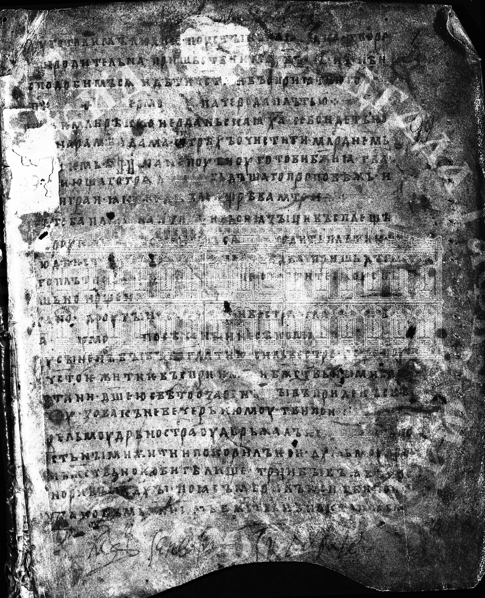
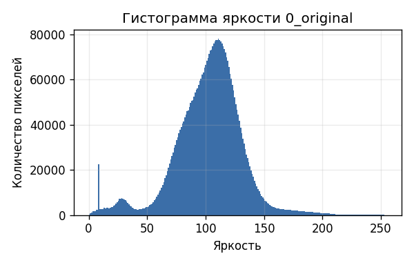
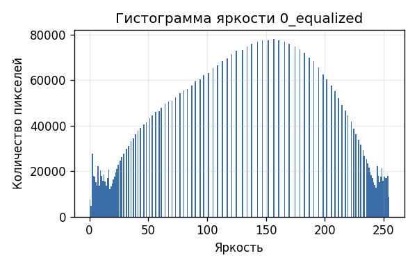
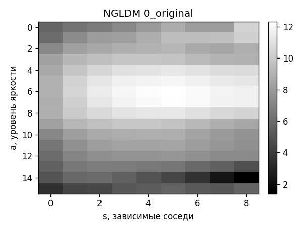
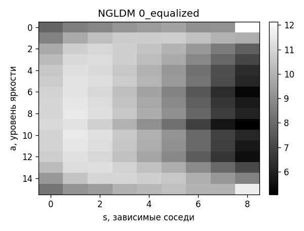
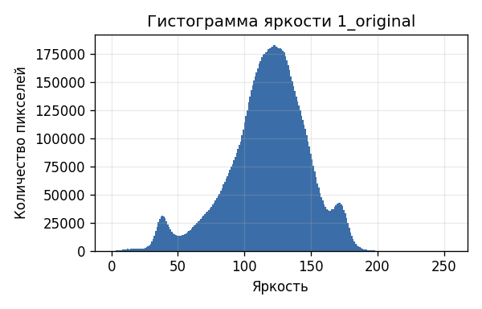
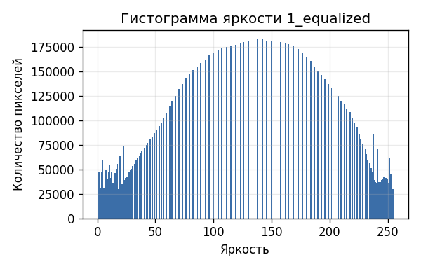
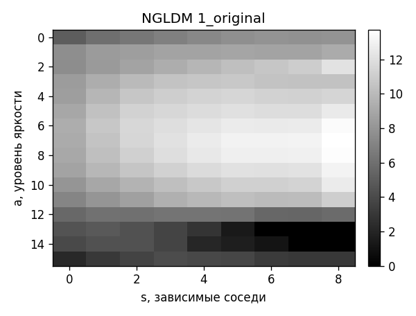
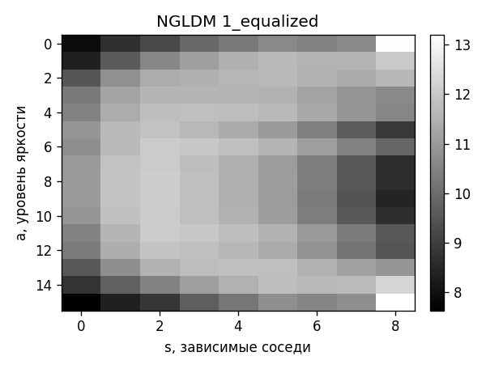

# Лабораторная работа №8
## Вариант 3. Текстурный анализ и контрастирование

Параметры варианта: матрица `NGLDM`, расстояние `d = 1`, признаки `CNG` и `CON`, метод преобразования яркости — выравнивание гистограммы.

`CNG` в отчёте считается как выраженность сильных зависимостей соседей, `CON` — как нормированная дисперсия уровней яркости по NGLDM.

Число уровней квантования яркости: `16`, критерий зависимости соседей: `|a_i - a_j| <= 0`. Матрицы визуализированы с логарифмическим нормированием.

Таблица признаков сохранена в [lab8/results/ngldm_features.csv](lab8/results/ngldm_features.csv).

### Изображение 0

| Исходное | Полутоновое | После выравнивания |
|:--------:|:-----------:|:-------------------:|
|  |  |  |

| Гистограмма до | Гистограмма после |
|:--------------:|:-----------------:|
|  |  |

| NGLDM до | NGLDM после |
|:--------:|:-----------:|
|  |  |

| Состояние | CNG | CON |
|:---------|---:|---:|
| До | 37.4683 | 0.014784 |
| После | 18.6215 | 0.093135 |

### Изображение 1

| Исходное | Полутоновое | После выравнивания |
|:--------:|:-----------:|:-------------------:|
|  |  |  |

| Гистограмма до | Гистограмма после |
|:--------------:|:-----------------:|
|  |  |

| NGLDM до | NGLDM после |
|:--------:|:-----------:|
|  |  |

| Состояние | CNG | CON |
|:---------|---:|---:|
| До | 52.1511 | 0.016259 |
| После | 31.8596 | 0.094178 |

### Вывод

Для исходных и контрастированных изображений построены NGLDM-матрицы, гистограммы яркости и признаки варианта. Выравнивание гистограммы меняет распределение яркости и, как следствие, значения текстурных признаков.
