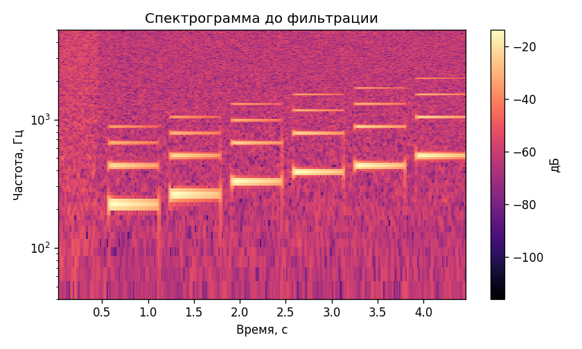
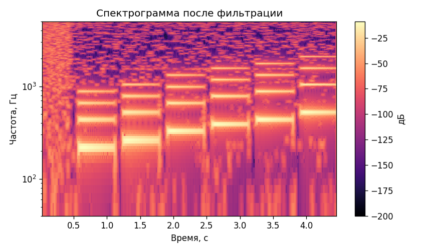

# Лабораторная работа №9
## Анализ шума

В репозитории не было записи музыкального инструмента с микрофона, поэтому для воспроизводимого отчёта создана синтетическая одноканальная WAV-дорожка с гармониками струнного инструмента и добавленным шумом.

Оригинал: [lab9/audio/instrument_original.wav](lab9/audio/instrument_original.wav)
Восстановленная дорожка: [lab9/audio/instrument_denoised.wav](lab9/audio/instrument_denoised.wav)

| До фильтрации | После фильтрации |
|:-------------:|:----------------:|
|  |  |

### Оценка шума

| Показатель | До | После |
|:----------|---:|------:|
| RMS шумового фрагмента | 0.043613 | 0.014702 |
| RMS всей дорожки | 0.180025 | 0.299291 |

Шум оценивался по первым 0.4 секунды дорожки, затем выполнялось спектральное вычитание среднего шумового спектра.

### Максимумы энергии

Окна энергии рассчитаны с шагом `Δt = 0.1 c` и `Δf = 50 Гц`. Полная таблица сохранена в [lab9/results/high_energy_patches.csv](lab9/results/high_energy_patches.csv).

| № | t0, c | t1, c | f0, Гц | f1, Гц | Энергия |
|:--:|-----:|-----:|-------:|-------:|--------:|
| 1 | 4.00 | 4.10 | 500 | 550 | 0.200987 |
| 2 | 2.60 | 2.70 | 350 | 400 | 0.175684 |
| 3 | 0.60 | 0.70 | 200 | 250 | 0.174927 |
| 4 | 1.30 | 1.40 | 250 | 300 | 0.168145 |
| 5 | 3.30 | 3.40 | 400 | 450 | 0.162955 |
| 6 | 2.00 | 2.10 | 300 | 350 | 0.141923 |
| 7 | 1.90 | 2.00 | 300 | 350 | 0.140169 |
| 8 | 0.70 | 0.80 | 200 | 250 | 0.120490 |

### Вывод

Построены спектрограммы до и после подавления шума, сохранена восстановленная дорожка и найдены наиболее энергичные временно-частотные области.
